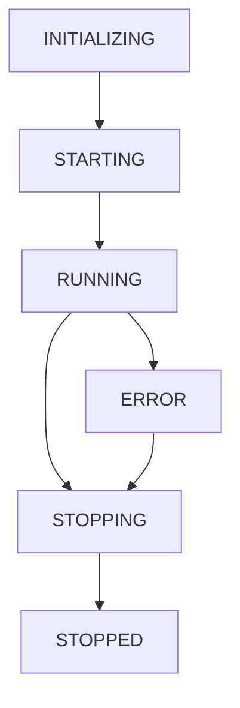

# Worker Lifecycle

Understanding the complete lifecycle of Pythia workers, from initialization to shutdown.

## Overview

Pythia workers follow a well-defined lifecycle with clear states and hooks for customization. This ensures reliable startup, graceful shutdown, and proper resource management.

## Worker States

```python
from pythia.core.lifecycle import WorkerState

# Available worker states
WorkerState.INITIALIZING  # Setting up configuration and connections
WorkerState.STARTING      # Running startup hooks
WorkerState.RUNNING       # Processing messages
WorkerState.STOPPING      # Graceful shutdown in progress
WorkerState.STOPPED       # Worker has stopped
WorkerState.ERROR         # Worker encountered an error
```

## Lifecycle Flow



## Basic Worker Lifecycle

```python
import asyncio
from pythia.core import Worker
from pythia.config import WorkerConfig

class BasicWorker(Worker):
    async def process_message(self, message):
        """Process a single message"""
        return {"status": "processed", "data": message.body}

    async def on_startup(self):
        """Called during worker startup"""
        self.logger.info("Worker starting up...")
        # Initialize resources, connections, etc.

    async def on_shutdown(self):
        """Called during graceful shutdown"""
        self.logger.info("Worker shutting down...")
        # Cleanup resources, close connections, etc.

# Run the worker
config = WorkerConfig(worker_name="basic-worker")
worker = BasicWorker(config=config)

# This will go through the complete lifecycle
asyncio.run(worker.start())
```

## Detailed Lifecycle Hooks

### Startup Hooks

```python
class DatabaseWorker(Worker):
    def __init__(self, config: WorkerConfig):
        super().__init__(config)
        self.db_pool = None
        self.cache_client = None

    async def on_startup(self):
        """Comprehensive startup sequence"""
        self.logger.info("Starting database worker...")

        # 1. Initialize database connection pool
        await self._setup_database()

        # 2. Setup cache connections
        await self._setup_cache()

        # 3. Verify external services
        await self._health_check()

        # 4. Setup monitoring
        await self._setup_monitoring()

        self.logger.info("Database worker startup complete")

    async def _setup_database(self):
        """Initialize database connection pool"""
        from asyncpg import create_pool

        self.db_pool = await create_pool(
            host="localhost",
            port=5432,
            user="worker",
            database="production",
            min_size=5,
            max_size=20
        )
        self.logger.info("Database pool initialized")

    async def _setup_cache(self):
        """Initialize cache client"""
        import aioredis

        self.cache_client = await aioredis.from_url(
            "redis://localhost:6379",
            encoding="utf-8",
            decode_responses=True
        )
        self.logger.info("Cache client initialized")

    async def _health_check(self):
        """Verify all services are healthy"""
        # Check database
        async with self.db_pool.acquire() as conn:
            await conn.fetchval("SELECT 1")

        # Check cache
        await self.cache_client.ping()

        self.logger.info("Health check passed")

    async def _setup_monitoring(self):
        """Setup custom metrics"""
        self.metrics.counter("database_queries_total")
        self.metrics.histogram("query_duration_seconds")
        self.logger.info("Monitoring setup complete")
```

### Shutdown Hooks

```python
class DatabaseWorker(Worker):
    async def on_shutdown(self):
        """Comprehensive shutdown sequence"""
        self.logger.info("Starting graceful shutdown...")

        # 1. Stop accepting new messages (handled by framework)
        # 2. Finish processing current messages
        await self._finish_current_work()

        # 3. Close external connections
        await self._cleanup_connections()

        # 4. Flush metrics and logs
        await self._flush_metrics()

        self.logger.info("Graceful shutdown complete")

    async def _finish_current_work(self):
        """Wait for current work to complete"""
        # Framework handles this automatically
        # This is for any additional cleanup
        current_tasks = len(asyncio.all_tasks())
        if current_tasks > 1:
            self.logger.info(f"Waiting for {current_tasks-1} tasks to complete")

    async def _cleanup_connections(self):
        """Close all external connections"""
        if self.db_pool:
            await self.db_pool.close()
            self.logger.info("Database pool closed")

        if self.cache_client:
            await self.cache_client.close()
            self.logger.info("Cache client closed")

    async def _flush_metrics(self):
        """Flush any pending metrics"""
        if hasattr(self, 'metrics'):
            # Prometheus metrics are automatically handled
            pass
```

## Signal Handling

Pythia workers handle system signals gracefully:

```python
import signal

class SignalAwareWorker(Worker):
    def __init__(self, config: WorkerConfig):
        super().__init__(config)
        self.setup_signal_handlers()

    def setup_signal_handlers(self):
        """Setup custom signal handlers"""
        # SIGTERM - Graceful shutdown (default behavior)
        signal.signal(signal.SIGTERM, self._handle_shutdown_signal)

        # SIGINT - Keyboard interrupt (Ctrl+C)
        signal.signal(signal.SIGINT, self._handle_shutdown_signal)

        # SIGUSR1 - Custom signal for reloading config
        signal.signal(signal.SIGUSR1, self._handle_reload_signal)

    def _handle_shutdown_signal(self, signum, frame):
        """Handle shutdown signals"""
        self.logger.info(f"Received signal {signum}, initiating shutdown...")
        # Framework will handle the actual shutdown
        asyncio.create_task(self.stop())

    def _handle_reload_signal(self, signum, frame):
        """Handle reload signals"""
        self.logger.info("Received reload signal, reloading configuration...")
        asyncio.create_task(self._reload_config())

    async def _reload_config(self):
        """Reload configuration without restart"""
        # Implement hot config reloading
        new_config = WorkerConfig()
        if new_config != self.config:
            self.logger.info("Configuration changed, applying updates...")
            self.config = new_config
            # Apply configuration changes
```

## Health Checks

```python
class HealthAwareWorker(Worker):
    def __init__(self, config: WorkerConfig):
        super().__init__(config)
        self.healthy = True
        self.last_health_check = None

    async def on_startup(self):
        """Setup health checking"""
        await super().on_startup()

        # Start periodic health checks
        asyncio.create_task(self._periodic_health_check())

    async def health_check(self) -> bool:
        """Check if worker is healthy"""
        try:
            # Check database connectivity
            if hasattr(self, 'db_pool') and self.db_pool:
                async with self.db_pool.acquire() as conn:
                    await conn.fetchval("SELECT 1")

            # Check message broker connectivity
            # This is handled by the framework

            # Check external services
            await self._check_external_services()

            self.healthy = True
            self.last_health_check = datetime.now()
            return True

        except Exception as e:
            self.logger.error(f"Health check failed: {e}")
            self.healthy = False
            return False

    async def _check_external_services(self):
        """Check external service dependencies"""
        # Example: Check API endpoint
        async with aiohttp.ClientSession() as session:
            async with session.get("https://api.example.com/health") as resp:
                if resp.status != 200:
                    raise Exception(f"API health check failed: {resp.status}")

    async def _periodic_health_check(self):
        """Run health checks periodically"""
        while self.state == WorkerState.RUNNING:
            await self.health_check()
            await asyncio.sleep(self.config.health_check_interval)
```

## Error Recovery

```python
class ResilientWorker(Worker):
    def __init__(self, config: WorkerConfig):
        super().__init__(config)
        self.error_count = 0
        self.last_error = None

    async def process_message(self, message):
        """Process message with error recovery"""
        try:
            result = await self._process_business_logic(message)

            # Reset error count on success
            if self.error_count > 0:
                self.logger.info("Error recovery successful")
                self.error_count = 0

            return result

        except Exception as e:
            self.error_count += 1
            self.last_error = e

            await self._handle_processing_error(e)
            raise

    async def _handle_processing_error(self, error: Exception):
        """Handle processing errors with recovery strategies"""
        self.logger.error(f"Processing error #{self.error_count}: {error}")

        # Circuit breaker pattern
        if self.error_count >= 5:
            self.logger.warning("Too many errors, entering recovery mode")
            await self._enter_recovery_mode()

    async def _enter_recovery_mode(self):
        """Enter recovery mode to prevent cascade failures"""
        self.logger.info("Entering recovery mode...")

        # Pause processing for a short time
        await asyncio.sleep(10)

        # Run health checks
        if await self.health_check():
            self.logger.info("Health check passed, resuming normal operation")
            self.error_count = 0
        else:
            self.logger.error("Health check failed, extending recovery period")
            await asyncio.sleep(30)
```

## Monitoring Worker State

```python
class MonitoredWorker(Worker):
    async def on_startup(self):
        """Setup state monitoring"""
        await super().on_startup()

        # Record startup metrics
        self.metrics.counter("worker_startups_total").inc()
        self.metrics.gauge("worker_startup_timestamp").set(time.time())

        # Start state monitoring
        asyncio.create_task(self._monitor_state())

    async def _monitor_state(self):
        """Monitor and report worker state"""
        while True:
            # Update state metrics
            self.metrics.gauge("worker_state").set(self.state.value)
            self.metrics.gauge("worker_uptime_seconds").set(
                (datetime.now() - self._startup_time).total_seconds()
            )

            # Log periodic status
            if self.state == WorkerState.RUNNING:
                processed = self.metrics.counter("messages_processed_total")._value
                self.logger.info(f"Worker healthy, processed {processed} messages")

            await asyncio.sleep(60)  # Report every minute

    async def on_shutdown(self):
        """Record shutdown metrics"""
        uptime = (datetime.now() - self._startup_time).total_seconds()

        self.metrics.histogram("worker_uptime_seconds").observe(uptime)
        self.metrics.counter("worker_shutdowns_total").inc()

        await super().on_shutdown()
```

## Advanced Lifecycle Management

### Custom Lifecycle Manager

```python
from pythia.core.lifecycle import LifecycleManager, WorkerState

class CustomLifecycleManager(LifecycleManager):
    """Custom lifecycle manager with additional features"""

    async def start_worker(self, worker):
        """Custom startup sequence"""
        self.logger.info("Starting custom worker lifecycle...")

        # Pre-startup phase
        await self._pre_startup_phase(worker)

        # Standard startup
        await super().start_worker(worker)

        # Post-startup phase
        await self._post_startup_phase(worker)

    async def _pre_startup_phase(self, worker):
        """Pre-startup custom logic"""
        # Validate environment
        await self._validate_environment()

        # Setup monitoring
        await self._setup_advanced_monitoring(worker)

    async def _post_startup_phase(self, worker):
        """Post-startup custom logic"""
        # Register with service discovery
        await self._register_with_discovery()

        # Start background tasks
        await self._start_background_tasks(worker)

# Use custom lifecycle manager
class AdvancedWorker(Worker):
    def __init__(self, config: WorkerConfig):
        super().__init__(config)
        self.lifecycle_manager = CustomLifecycleManager(config)
```

## Best Practices

### 1. Resource Management

```python
class ResourceManagedWorker(Worker):
    async def on_startup(self):
        """Proper resource initialization"""
        try:
            # Initialize resources in order
            await self._init_database()
            await self._init_cache()
            await self._init_external_clients()

        except Exception as e:
            # Cleanup on startup failure
            await self.on_shutdown()
            raise

    async def on_shutdown(self):
        """Proper resource cleanup"""
        # Cleanup in reverse order
        if hasattr(self, 'external_clients'):
            await self._cleanup_external_clients()

        if hasattr(self, 'cache'):
            await self._cleanup_cache()

        if hasattr(self, 'db'):
            await self._cleanup_database()
```

### 2. Graceful Degradation

```python
class GracefulWorker(Worker):
    def __init__(self, config: WorkerConfig):
        super().__init__(config)
        self.degraded_mode = False

    async def process_message(self, message):
        """Process with graceful degradation"""
        if self.degraded_mode:
            return await self._process_degraded(message)

        try:
            return await self._process_normal(message)
        except ExternalServiceError:
            # Enter degraded mode
            self.degraded_mode = True
            self.logger.warning("Entering degraded mode")
            return await self._process_degraded(message)
```

### 3. Configuration Reload

```python
class ReloadableWorker(Worker):
    async def reload_config(self):
        """Reload configuration without restart"""
        old_config = self.config
        new_config = WorkerConfig()

        if new_config != old_config:
            self.logger.info("Configuration changed, reloading...")

            # Apply new configuration
            self.config = new_config

            # Reinitialize components if needed
            await self._apply_config_changes(old_config, new_config)
```

## Testing Worker Lifecycle

```python
import pytest
from pythia.utils.testing import WorkerTestCase

class TestWorkerLifecycle(WorkerTestCase):
    async def test_startup_sequence(self):
        """Test worker startup"""
        # Worker should start successfully
        await self.worker.start()
        assert self.worker.state == WorkerState.RUNNING

    async def test_shutdown_sequence(self):
        """Test graceful shutdown"""
        await self.worker.start()
        await self.worker.stop()
        assert self.worker.state == WorkerState.STOPPED

    async def test_error_recovery(self):
        """Test error handling and recovery"""
        # Simulate error condition
        with pytest.raises(Exception):
            await self.worker._handle_error(Exception("Test error"))

        # Worker should recover
        assert self.worker.state != WorkerState.ERROR
```

## Next Steps

- [Message Handling](message-handling.md) - Deep dive into message processing
- [Configuration](configuration.md) - Complete configuration guide
- [Error Handling](error-handling.md) - Advanced error handling patterns
